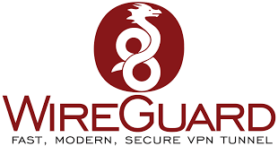

# WireGuard Auto (WG Auto)

A professional, web-based Django application designed to automate and manage WireGuard VPN server and peer configurations. It provides an intuitive admin panel, automatic QR code generation, client configuration delivery via email, and robust asynchronous task processing using Celery.



## Features

- **Automated Peer Onboarding**: Generates WireGuard configuration, keys, and QR codes automatically.
- **Email Delivery**: Delivers peer configuration details, setup guides, and QR codes via email.
- **Split-Tunneling Support**: Automatically derives and handles split-tunnel settings for routing specific subnets.
- **Platform-Specific Guides**: Generates Markdown-based configuration guides for Windows, macOS, Linux, Android, and iOS clients.
- **Robust Background Processing**: Uses Celery and Redis to handle non-blocking asynchronous key generation and configuration application securely.
- **Professional Admin UI**: Uses Django Jazzmin for a clean, responsive, and highly professional administrative interface.
- **Production-Ready Docker**: Fully containerized using multi-stage builds, Gunicorn, PostgreSQL, and Nginx reverse proxy capabilities.

## Requirements

- Docker & Docker Compose
- Or standard Linux environment with Python 3.11+, PostgreSQL, Redis, and `wireguard-tools`.

## Installation (Docker)

The fastest and most stable way to deploy WireGuard Auto is using our official pre-built Docker image (`tuinnov8/wg-auto:latest`).

1. Download the production `docker-compose.yml` and `.env.example` to your server.
2. Rename `.env.example` to `.env` and securely configure your `DATABASE_PASSWORD`, `DJANGO_SECRET_KEY`, and `ENCRYPTION_KEY`.
3. Bring up the containers (this will automatically pull the image from Docker Hub):
   ```bash
   docker compose up -d
   ```
4. Access the application on port `8004`.

## Security

- Private keys and SMTP passwords are encrypted at rest using Fernet encryption.
- Multi-stage Docker build avoids leaving build dependencies in production images.
- System processes execute commands with restricted `sudo` rules to maintain server isolation.

## Contribution

We welcome contributions! Please review our [Contributing Guide](CONTRIBUTING.md) to get started.

## License

This project is open-source and released under the [MIT License](LICENSE).
