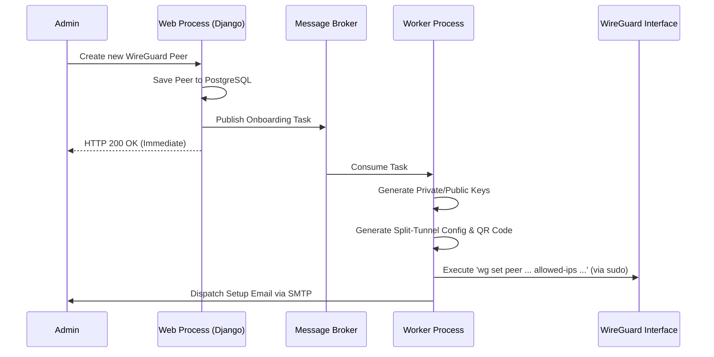

# WireGuard Auto: System Architecture

## 1. Overview
WireGuard Auto is a robust, asynchronous infrastructure management platform designed to automate WireGuard VPN configurations. Built on top of the Django framework, it integrates with a Celery task queue to perform high-privilege networking commands asynchronously, ensuring the web interface remains highly responsive and completely isolated from root-level system operations.

## 2. Core Components

### 2.1. Django Web Application
The core control plane is built in Django, providing the data schema, ORM, and the Jazzmin-powered administrative interface. It serves as the primary interaction point for administrators to manage servers and peers.

### 2.2. PostgreSQL Database
Relational storage backing the Django ORM. Stores state for `WireGuardServer`, `WireGuardPeer`, and `SMTPSettings`. 

### 2.3. Redis Cache & Message Broker
Serves a dual purpose within the architecture:
*   **Cache Backend**: Caches rendered configurations, active peer lists, and SMTP settings to drastically reduce database load.
*   **Message Broker**: Routes asynchronous tasks between the Django web processes and Celery workers.

### 2.4. Celery Task Queue
Background task workers that execute heavy, blocking, or privileged operations. This decoupling is critical for the application's stability. The Celery container is designed to run directly on the host machine's physical network stack (`network_mode: "host"`) to seamlessly manage kernel interfaces. Operations include:
*   Peer onboarding (Key generation, Configuration generation, QR Code generation).
*   Live WireGuard interface modifications (`wg set`).
*   Config synchronization (`/etc/wireguard/wg0.conf` regeneration).
*   Email dispatching.

### 2.5. WireGuard Subsystem
The low-level network interface layer. The application interfaces with the system's `wg` binary and `iptables`/`nftables` to route packets and enforce access controls.

---

## 3. Data Models

### WireGuardServer
Represents a physical or virtual WireGuard network interface.
*   **Network Definition**: Handles the CIDR block, MTU, DNS, and Uplink configurations.
*   **Cryptography**: Generates and securely stores the server's Private and Public keys.
*   **Caching**: Employs aggressive cache invalidation strategies on save/delete events.

### WireGuardPeer
Represents an individual client device.
*   **Identity**: Bound to an email address and platform profile.
*   **Routing**: Derives split-tunnel rules from the parent `WireGuardServer`.
*   **State Machine**: Activating or deactivating a peer asynchronously modifies the live network interface without restarting the tunnel.

---

## 4. Component Interaction Flow

The following Mermaid diagram illustrates the lifecycle of a peer creation event.

## 5. Caching Strategy
To minimize disk I/O and database latency, WireGuard Auto employs a strict caching architecture:
*   **Active Peers (`WG_ACTIVE_PEERS_CACHE_KEY`)**: An aggregated list of peers required for generating `wg0.conf`. This is invalidated whenever a peer's status changes.
*   **Server Config (`WG_SERVER_CONFIG_CACHE_KEY_PATTERN`)**: Reused extensively during peer config generation.
*   **Security Precaution**: Raw decrypted private keys are explicitly excluded from all caching mechanisms to prevent memory leaks in Redis.
